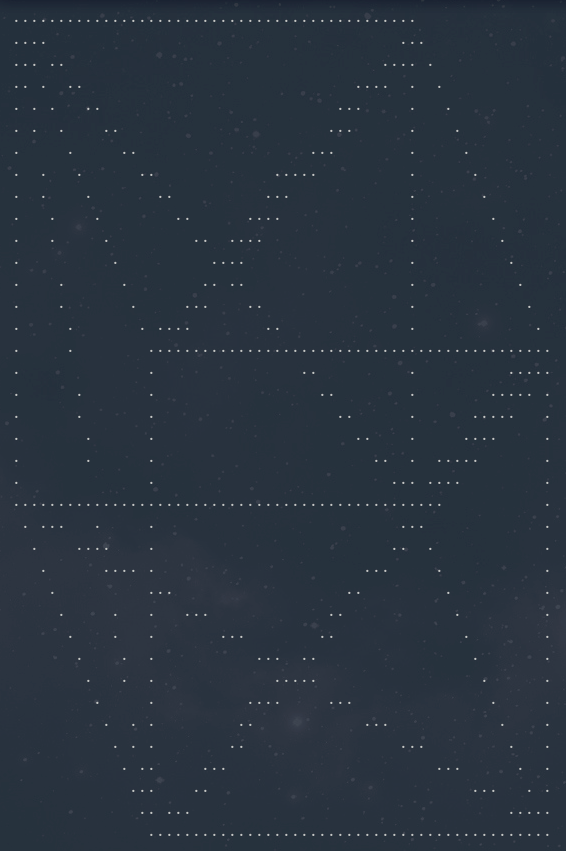

# Nim Cube Test (WIP)

Testing rendering a 3D cube in the command line

Goals:
- Hide triangles that are behind other triangles
- Fill triangles
- Rewrite so that the code doesnt suck
- Replace all ints with floats
- Replace hardcoded values with values ralative to the screen size
